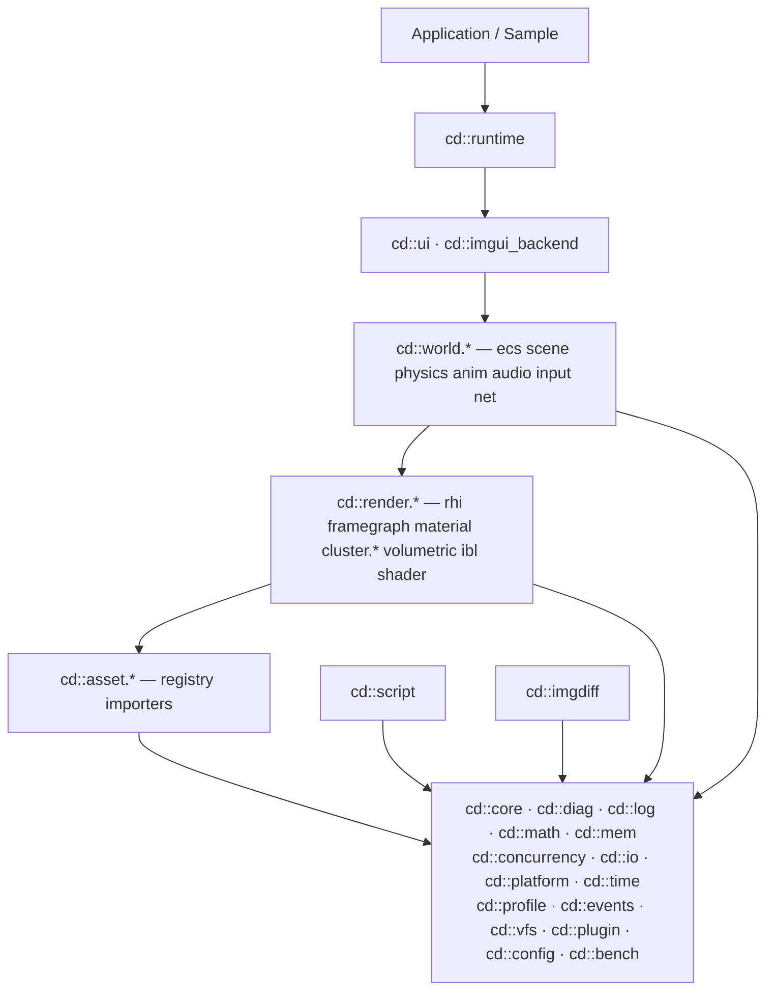

# CHROMODYNAMIC — Architecture

This document gives the big-picture view of how the engine is layered, how
libraries depend on each other, and the cross-cutting conventions every
subsystem follows. For the detailed per-library catalogue see
[LIBRARIES.md](LIBRARIES.md); for design rationale see the ADR archive
under [ADR/](ADR/).

---

## 1. Mental model

CHROMODYNAMIC is a **stack of independently consumable libraries**.
Every library:

- builds in isolation (its own gtest binary, `ctest --preset ninja-debug`
  ships each library's tests separately);
- has a single public include root `engine/<lib>/include/cd/<lib>/`;
- exposes one C++ namespace `cd::<lib>`;
- depends *only* on libraries below it in the DAG.

Above the foundation tier the engine assembles those libraries into
the runtime, but the runtime is not load-bearing for any one library —
you can drop `cd::asset` or `cd::math` into another codebase without
the rest of the tree.

```
+-------------------------+
|   Application / Sample  |       runtime entrypoint, no engine code beyond glue
+-----------+-------------+
            |
+-----------v-------------+
|        Runtime          |       headless loop, plugin orchestration
+-----------+-------------+
            |
+-----------v-------------+
|   UI / ImGui backend    |       editor + game UI (depends on render)
+-----------+-------------+
            |
+-----------v-------------+
|         World           |       ecs, scene, physics, animation, audio,
|                         |       input, net  — gameplay-facing primitives
+-----------+-------------+
            |
+-----------v-------------+
|         Render          |       rhi (vulkan / d3d12 / metal / null /
|                         |       native dispatcher), framegraph,
|                         |       material, cluster (CPU + GPU + PBR
|                         |       integration), volumetric, ibl
+-----------+-------------+
            |
+-----------v-------------+
|         Asset           |       registry, ids, importers (glTF, OBJ,
|                         |       KTX2, WAV, PAK, JSON, image, native
|                         |       cd_mesh / cd_tex)
+-----------+-------------+
            |
+-----------v-------------+
|       Foundation        |       core (Result, ErrorCode, Handle,
|                         |       CVar), diag (Assert, panic), log,
|                         |       math, mem, concurrency, io, platform,
|                         |       time, profile, events, vfs, plugin,
|                         |       bench, config
+-------------------------+
```

The two side libraries `cd::script` (Lua 5.4) and `cd::imgdiff`
(perceptual diff) sit alongside Render — they depend on Foundation and
nothing else above it.

## 2. Dependency DAG

The DAG below collapses individual libraries into their tier; within
a tier libraries are allowed to depend on peers at the same level only
when the per-library catalogue explicitly says so. The configure-time
check in `cmake/CDProject.cmake::cd_add_library` rejects cycles.



## 3. Cross-cutting conventions

These are not negotiable; the CI matrix enforces them.

### 3.1 Error handling

- **Fallible boundaries return `cd::core::Result<T>`** (alias for
  `std::expected<T, ErrorCode>`). Hot code paths never throw. See
  `engine/foundation/core/include/cd/core/Result.hpp`.
- **Invariant violations panic via `cd::diag`.** `CD_ASSERT(expr)` is
  debug-only, `CD_VERIFY(expr)` stays in release. Both route through
  the process-wide `PanicHandler` so tests can swap "abort" for
  "throw" and production can route to telemetry.
- **Empty `catch(...) {}` is forbidden.** A `catch(...)` block is
  permitted only when it *observably* records or routes the failure —
  e.g. increments a failure counter, emits a log line, bumps a stat,
  or sets an error flag visible to the caller — AND the file is
  enumerated in [docs/EXCEPTION_BOUNDARIES.md](EXCEPTION_BOUNDARIES.md)
  with a justification. Silently swallowing an unknown exception is
  always wrong; demoting one to a counted, observable boundary is
  sometimes the right shape (detached worker bodies, format-error
  fallbacks on a logger that must not itself throw, sink-write
  failures that the caller cannot meaningfully react to).
- **Error codes pretty-print via `cd::core::format(ec)`** — domain and
  enumerator names come from a registry, so `core::InvalidArgument: x
  must be >= 0` is the standard log line, not `0:2 x must be >= 0`.

### 3.2 Memory + ownership

- Owning pointers are `std::unique_ptr` / `std::shared_ptr`. Raw
  pointers are non-owning observers.
- Resource handles are `cd::core::Handle<Tag>` (8 bytes, generation +
  index + type id), backed by `cd::core::HandleStore`. Stale handles
  are defeated by the generation counter, not by hoping nobody kept
  the pointer.
- Library boundaries should not pass naked containers; either pass a
  `std::span` (read), a `Result<T>` (return), or a handle (own).

### 3.3 C++ surface

- C++23. `static_cast<T>(x)` over C-style casts. `[[nodiscard]]` on
  fallible returns. `override` mandatory on virtuals. `noexcept` only
  where it is honest — see the lesson in
  [diag/Assert.hpp](../engine/foundation/diag/include/cd/diag/Assert.hpp):
  the panic dispatch is *not* noexcept because a throwing handler
  (test mode) must be allowed to propagate.

### 3.4 Build

- `-Wall -Werror -Wextra -Wshadow -Wnon-virtual-dtor -Wpedantic
  -Wconversion -Wsign-conversion -Wdouble-promotion -Wformat=2` on
  the host build. `-Wno-error=double-promotion` does NOT exist; if
  a literal mixes float and double, fix the literal.
- ASAN / UBSAN active on the debug preset; TSan has its own preset.
- Compiler matrix: MSVC, Clang-CL, Clang, GCC. The CI matrix on
  Windows currently runs all four; per-OS expansion is queued in
  Phase 10 Sprint 3.

### 3.5 Test

- gtest. Per-library binary `cd_test_<lib>`. No `sleep_for` in tests
  (condition_variable / event-driven sync only).
- Edge + negative cases are not optional; the per-subsystem audit
  rejects PRs that only cover the happy path.
- Renderer subsystems use golden-image diffs via `cd::imgdiff` (FLIP /
  SSIM / PSNR).

## 4. Build + test loop

The single source of truth is the CMake preset surface:

```bash
# configure
cmake --preset ninja-debug

# build
cmake --build --preset ninja-debug

# test
ctest --preset ninja-debug --output-on-failure
```

Other presets: `ninja-release`, `ninja-debug-asan`, `ninja-debug-ubsan`,
`vs2022-base`, `vs2026-base`, `ci-vs2022`, `ci-vs2026`, `ci-msvc`,
`ci-clangcl-win`, `ci-llvm-win`, `ci-docs`.

API docs:

```bash
cmake -B build/ninja-base -DCD_ENABLE_DOXYGEN=ON
cmake --build build/ninja-base --target cd_docs
# → build/ninja-base/docs/doxygen/html/index.html
```

## 5. Adding a new subsystem

The minimum checklist:

1. Decide its tier (read the DAG, never violate downward flow).
2. Author an ADR under `docs/ADR/ADR-YYYYMMDD-<topic>.md` (Iglberger
   format: Context / Decision / Rejected alternatives / Consequences).
   If the subsystem is a SOTA-influenced choice (rendering, ECS,
   concurrency, allocator), cite peer-reviewed work via the Demir Kural
   pipeline (`research/library/MANIFEST.csv` + `bibliography.bib`).
3. Add the directory `engine/<lib>/` with `CMakeLists.txt`,
   `include/cd/<lib>/`, `src/`, `tests/`.
4. Register the library via `cd_add_library(<name> SOURCES ... PUBLIC_DEPS
   cd::<dep> ...)`. The macro stamps include paths, warning flags, and
   the dependency DAG check.
5. Add `add_subdirectory(<lib>)` to the parent tier's `CMakeLists.txt`
   at the position that respects tier order.
6. Register the test target with `cd_add_test`. New tests must turn
   green on the same `ctest --preset ninja-debug` run as the rest.
7. Add a `@defgroup` entry to [Modules.dox](Modules.dox) and put
   `@ingroup` on the new public headers so the API renders in the
   Doxygen sidebar.

## 6. GPU vendor notes (Phase 11 Track B)

The engine renders through `cd::rhi_vulkan`. Vulkan is spec-driven,
but vendor implementations diverge in extension support, rounding
behaviour, and queue layout. This section is the running ledger of
what's been validated on which silicon.

### Device selection

By default `cd::rhi_vulkan::pick_physical_device` prefers the discrete
GPU when the loader sees multiple physical devices (the desktop
machine + integrated-laptop case). Override per process via env
variable:

```bash
CD_VULKAN_DEVICE_INDEX=0   ./build/.../bin/Debug/hello_triangle
```

Index N corresponds to `vkEnumeratePhysicalDevices`'s N-th entry.
Out-of-range values are ignored with a stderr warning (falls back to
the discrete-preference policy). The diagnostic prints
`[cd-rhi-vulkan] CD_VULKAN_DEVICE_INDEX=N -> <deviceName>` on stderr
so test harnesses can confirm which device they're hitting.

### Validated combinations (Phase 11 baseline)

| Vendor | Device | Driver | OS | Result |
|---|---|---|---|---|
| NVIDIA | GeForce RTX 3080 Laptop GPU | 595.97 / DRIVER_ID_NVIDIA_PROPRIETARY | Windows 11 | ✅ baseline (golden references in `tests/golden/nvidia/`) |
| Intel | Iris Xe Graphics (Tiger Lake iGPU) | 101.4502 / DRIVER_ID_INTEL_PROPRIETARY_WINDOWS | Windows 11 | ✅ all 5 wired samples pass; golden set in `tests/golden/intel/` |
| Mesa lavapipe | software ICD | Mesa 24.x (Ubuntu 24.04) | Linux CI | 🟡 wired in `linux-vulkan-sw` CI job; goldens not yet captured |
| AMD | n/a | n/a | n/a | ⬜ Track B Part 2 carry-over |
| Apple Metal (MoltenVK) | n/a | n/a | n/a | ⬜ Track B Part 2 carry-over |

### Cross-vendor empirical noise floor (NVIDIA vs Intel iGPU)

Captured under the same source tree, same shaders, same MVP — the
only variable is which physical device the Vulkan loader selects.
Numbers come from running each sample under `CD_VULKAN_DEVICE_INDEX=0`
(Intel) and diffing against the NVIDIA reference in
`tests/golden/nvidia/` via `cd::imgdiff::compare`:

| Sample | Max delta / channel | RMSE (0-255) | PSNR |
|---|---|---|---|
| hello_triangle | 1 / 255 | 0.05 | 73.6 dB |
| hello_anim | 1 / 255 | 0.02 | 80.8 dB |

(phase1142: hello_cube / hello_pbr / hello_skybox rows retired with
their samples in batch-2 consolidation; the historical measurement
showed the same ≤ 1/255 delta, PSNR 65.0-77.9 dB.)

Takeaways:

1. **Cross-vendor delta is ≤ 1/255 per channel** across all wired
   samples. Vulkan's "spec-compliant rasterization" lives up to its
   reputation for these test cases.
2. **PSNR > 65 dB** on every sample — academically "lossless"
   (>50 dB is the usual practical threshold).
3. The single-vendor noise budget the gate ships with (8/255 per
   channel) already covers cross-vendor diff with headroom — the
   gate's tolerance is the *driver round-off* envelope, not the
   *visual difference* envelope.

### Capturing a new vendor's golden set

When a new GPU lands:

```bash
# Pick the device explicitly via the env var.
CD_VULKAN_DEVICE_INDEX=N \
  pwsh -File scripts/run_golden.ps1 -Mode capture -Vendor <slug>  # Windows

CD_VULKAN_DEVICE_INDEX=N \
  ./scripts/run_golden.sh --mode capture --vendor <slug>          # POSIX
```

Writes to `tests/golden/<slug>/<sample>.png`. Commit the directory.
Once committed, downstream consumers can run compare against that
vendor's set with `... -Vendor <slug>` / `--vendor <slug>`.

`<slug>` convention: lowercase, single word: `nvidia`, `intel`, `amd`,
`apple`, `lavapipe`, `swiftshader`.

## 7. Pointers

- [LIBRARIES.md](LIBRARIES.md) — per-library catalogue (target name,
  alias, namespace, include root, responsibility).
- [DESIGN.md](DESIGN.md) — long-form design rationale (older).
- [PLAN.md](PLAN.md) — historic sprint plans (Phase 1 through Phase 9
  retrospectives live in ADRs).
- [ADR/](ADR/) — the canonical decision log.
- [Modules.dox](Modules.dox) — Doxygen module hierarchy.
- [CLAUDE.md](../CLAUDE.md) — project-wide standards (loaded by every
  AI subagent).
